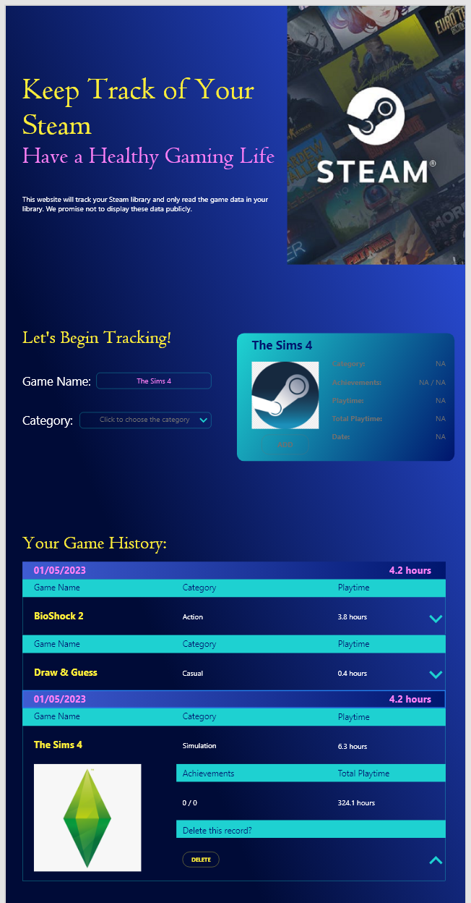
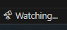

# tzha9554-tracker

 
 
 

# 1. Introduction of this web application
This webpage is about media consumption, mainly about games. The webpage helps users to quickly record and browse the games they have played on Steam. The main purpose of this page is to help users track their gaming hours for a healthy gaming life. The website automatically generates the total number of hours played in a day and the total number of hours played for each game. After the user enters the name of the game, the game category and the playing time, this information is saved in local storage to keep the page continuously accessible.
 
 
 

# 2. Intruction of running the web application
To get this web application, you can download this folder to your computer and open it with VS code. Type "npm run dev" in the terminal to run the server and open the web application.
 
 
 

# 3. Instruction of using the web application
This web application consists of four sections: homepage, userEnter, userCheck, My Game History. 
1. The homepage contains the main title of this web application and the privacy statement.
 

2. In the userEnter section, you need to enter the name of the game, the playtime of the game and select the category of the game. You can only enter a number with a maximum of one decimal place for the playtime of the game. 
 

3. Once you have entered the game, click on the check button and the game information you have entered will be displayed in the card in userCheck on the right. Here you can see the total playtime you have played the game and check if the data you have read is incorrect.
 

4. Click on the Add button in the userCheck card and the game information you entered will be added to the top of the My Game History list, which is displayed in reverse chronological order and shows the total number of hours you have played on each day.
 

5. In My Game History list, each game history is displayed with its name and the playtime. You can click the expand button to see its category and the total playtime you have played the game. Once you have expanded the game information, you can delete the game history. 
 

6. All the games in My Game History are stored in local storage, which means that if you refresh the page or close it and open it again, the My Game History list will not disappear. You can close or refresh this web application at any time.
 
 
 

# 4. web application mockup version 1

In mockup version 1, I designed the web application to link to the Steam API. As the user enter the game name and select the game category, the web application will fetch the game in Steam API and display the detailed game information in the card on the right side. Then, when user clicks Add button, this game record will be added to the Game History list.

Here is my mockup version 1 on desktop:

Here is my mockup version 1 on mobile:

As you can see in the picture, the color of the web page is too bright to see the game infomation. In version 1, I didn't consider the web readability.

Also, according to tutor's feedback, add a clear button for the userEnter section iis more usefull. So, I searched lots of well-designed websites online and summarized some common features of these websites:

1. Color white is the most commonly used background color for websites. If you want to add a main color for the website, you can just set the button color or nevagation bar color to the main color. 

2. Website page for desktop version is too wide for users to read from left to right. Adding the left and right margin to the website and set the website content in the middle will increase the readability of the website.

3. The web application should be easy to use for users. For example, add some instructions to let users know what they need to do.

 
 
 

# 5. web application mockup version 2
Accroding to these, I designed a new web mockup for my web application. 

Changes I have made:
1. Changed the format and color of the web application, and add the left and right margin to set the web content in the middle. 
2. Set the main color of my web application to mint green, which matches well with the theme of my web application -- Steam Games.
2. Added a clear button to clear all user input. 
3. Added some instructions to tell users how to use this web application.
4. Added page divider to cut the web application to four sections in order to make the sturcture of the web application more clear.
5. Redesigned the Game History list, display the playtime on each day to help users check the playtime more convenient.

Here is my web application mockup version 2 on desktop:

I didn't drew the web application version 2 on mobile, because the mobile version will just simplly move the userCheck section to the buttom of userEnter section.

 
 
 

# 6. How did I create my web application
After I decided my final mockup, I started to create this web application. 

I used gitHub to create my document. gitHub helps me to store each commit of my web application so that I can check them easily. For example, in my gitHub file, I have 9 commits for now. Each commit noted the changes I have made to my web application.

1. I followed Week6 content to set the web server for my web application. I import npm, node.js and express.js.
2. I wrote my homepage code by just using index.html and style.css because homepage doesn't contain any interaction. The homepage in my web application is slightly different to my mockup. I set the homepage background to a picture. In this case, users can immeadieately find out this web application is about Steam games. Here is my homepage in web application: 

3. After I finished my homepage, I followed week 8's content to set the parcel and scss to my web application. I can write looped css function in scss, which helps me save a lot of time to check the variable id again and again. 

4. After this, I found that it is not very convenient to link html file directly to scss file. Sometimes the web applicatiob could not fetch the code in scss file. So, I added a live cass compiler to lively update my main.scss file to my main.css file and I link the html file to main.css file.    

5. I started to write my userEnter & userCheck section. Befor I worte these two sections, I need to search the Steam API link and import the API link to my web application. However, the Steam APIs that I can find are all about user library, which I need is the API that contains the name and picture of all games in Steam. So, I decided to not impport any API or game picture to my web application. Then I redesigned my web mockup to this:     Also, while I was writing the code for the userEnter and userCheck section, I found that the web application need to add some errorMessage. I will show the errorMessages after.

6. After finish my userEnter and userCheck sections, it's time to write the My Game History section. This is the part that challenges me the most because of the localStorage. Espacially the function updateGameHis(), which is from line 171 to 285 in script.js file. So, in the script.js file, I wrote lots of comments to remind me the purpose of each section of the code and help me to degub my code.

7. Finally, I made my web application be responsive for both mobile and desktop. Actually, I made my web application be responsive for phone(width<=600px), ipad (601px < width < 1024px) and desktop (width>1024px).

 
 
 

# 7. About errorMessage
1. If users click the check button without enter any game informantion, the error message = "Please enter the game information."

2. If users click the check button without enter the game name, the error message = "Please enter the Game Name."

3. If users click the check button without enter the playtime, the error message = "Please enter the Playtime."

4. If users click the check button with enter words or two decimal number in playtime, the error message = "Please enter a numerical value with one decimal place."

5. If users click the check button without select the category, the error message = "Please select the Category."

6. If users click the Add button without click the Check button first, the error message = "CANNOT be added to game history. Please finish stept 1 first."

# 8. Any furthur stepts

1. In the main.scss file, the code for ipad and phone should be slimplified and shortened.

2. Adding a Steam API to fetch the game picture will make the web application more usefull. Or, directly link this web application to user's Steam Library and automaticlly generate the game history of the user, so that users no longer need to enter any game information. Users can just open the web application and check the playtime.

3. The homepage background picture is not fixed to the position. 

4. The web application link can only be opened on the desktop that downloaded the whole file. Find a way to let any desktop or phone can access the web application link. 

# 9. Reference
homepage picture link: 

https://cdn.akamai.steamstatic.com/store/home/store_home_share.jpg

